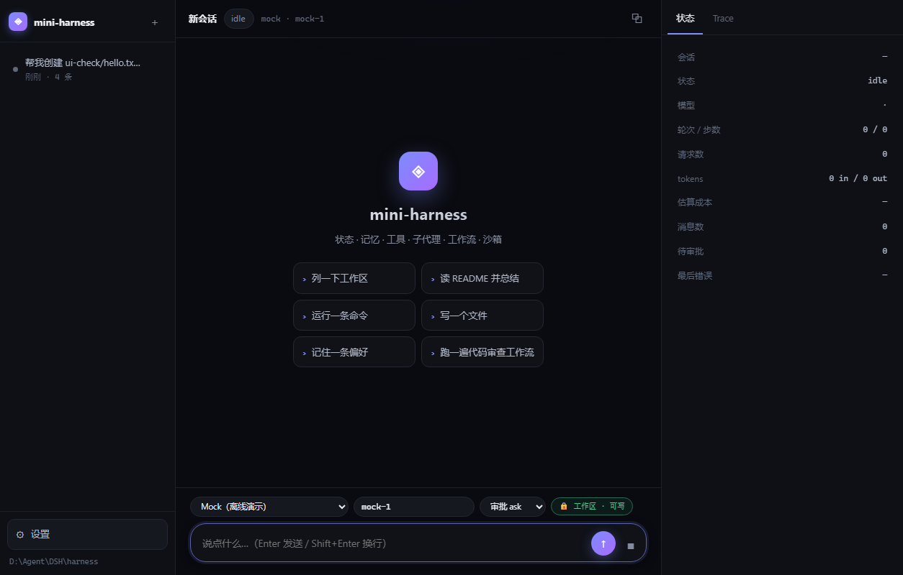
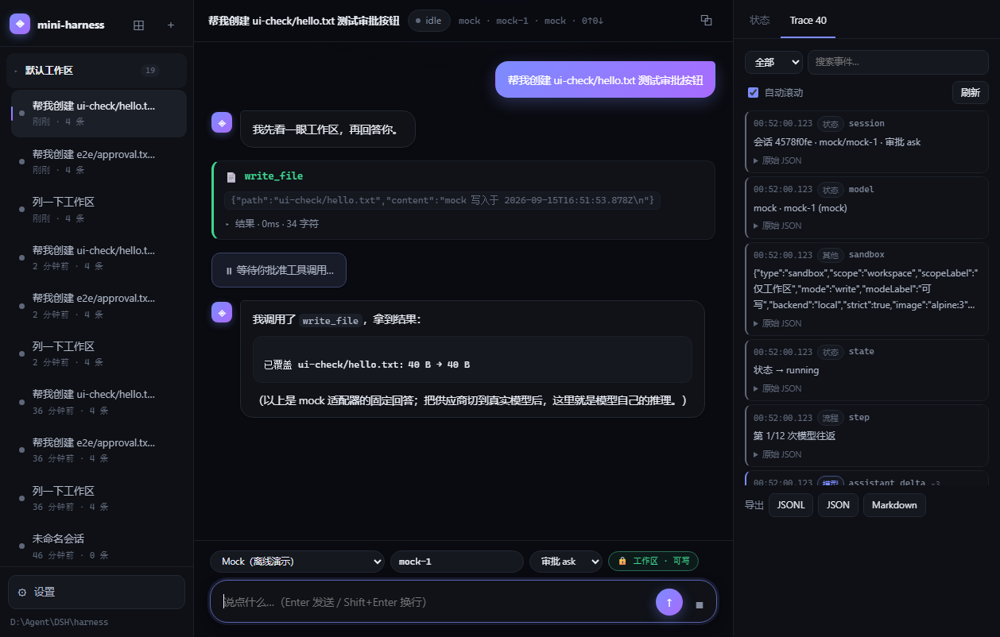
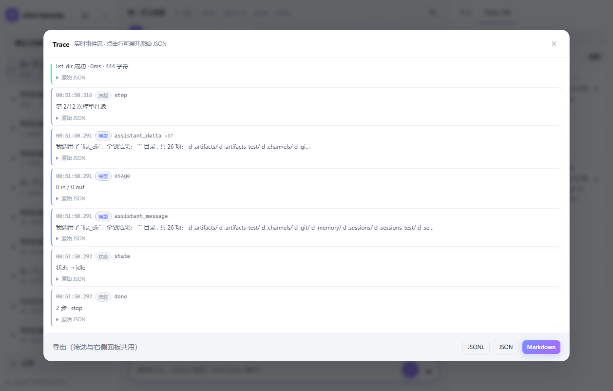
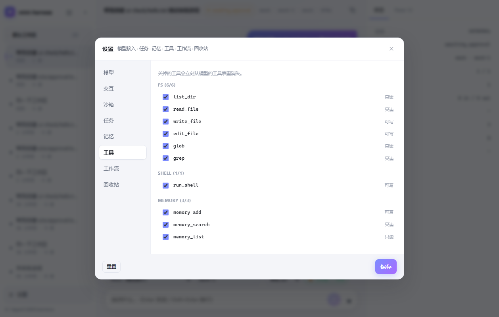
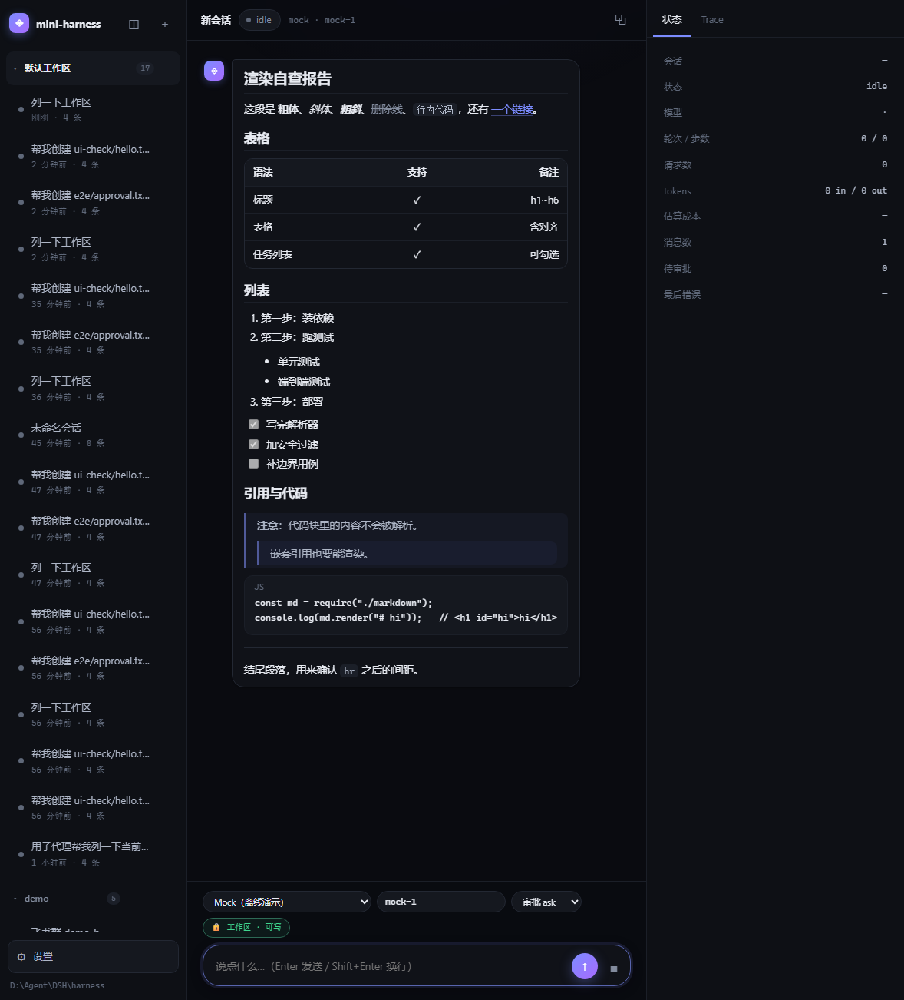
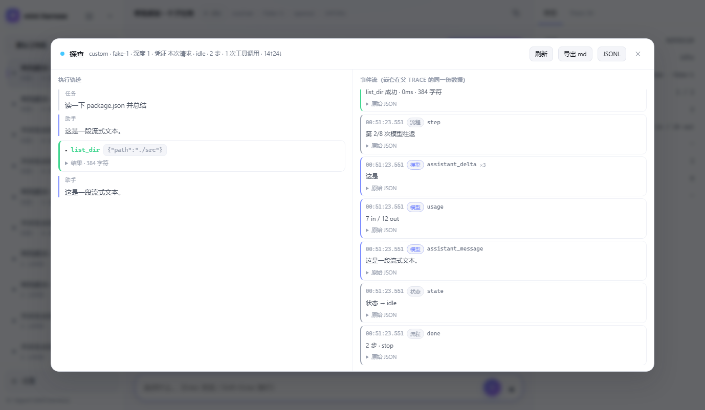
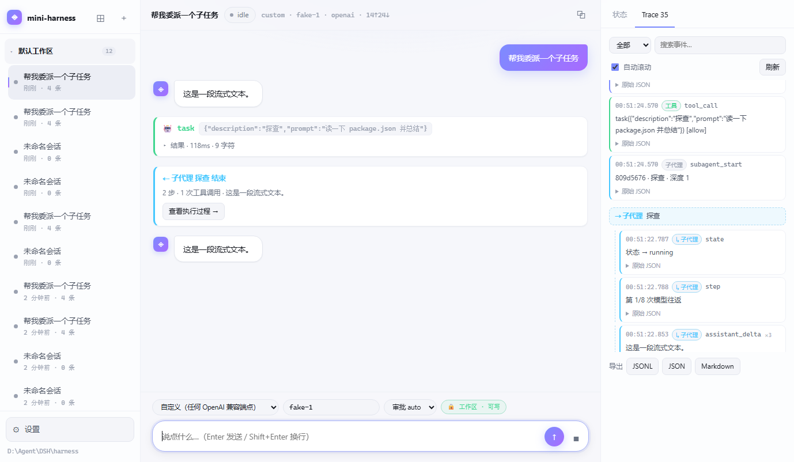
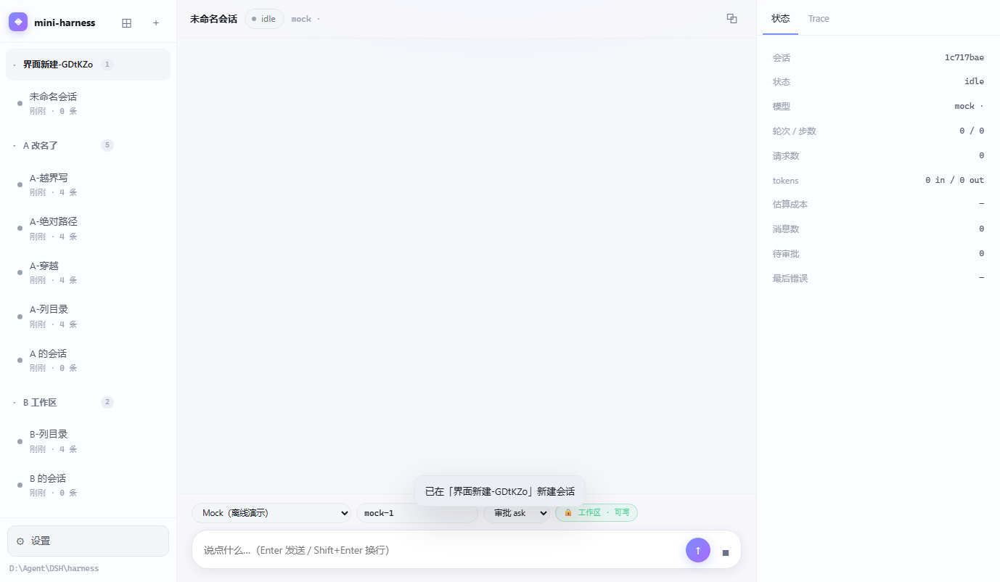
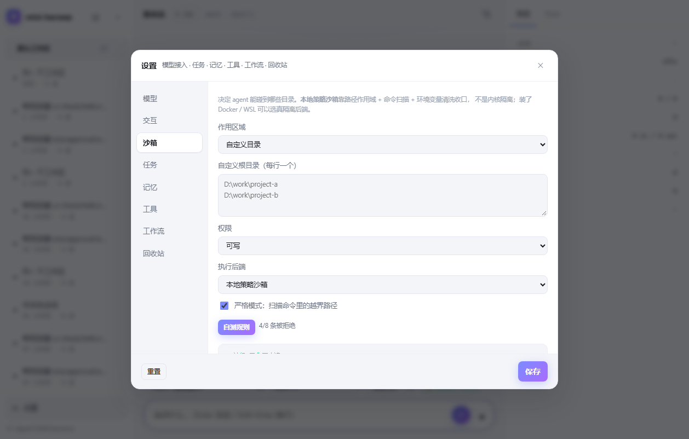
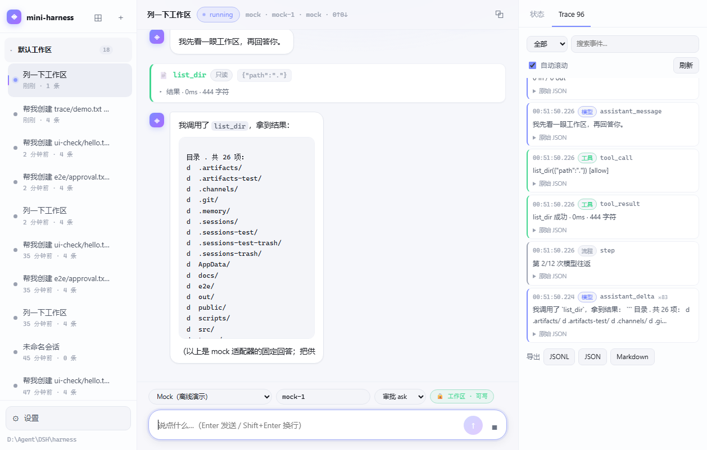

# mini-harness

一个**完整可用的 agent harness**：零第三方依赖，Node 18+ 直接跑，自带前端。
不是 demo —— 状态机、长期记忆、工具生态、子代理、工作流、沙箱、可观测性都是真能跑的。



| 对话 · 工具调用 · 审批 | Trace 全屏 · 三种格式导出 |
|---|---|
|  |  |

| 设置 · 工具开关 | Markdown 渲染 |
|---|---|
|  |  |

| 子代理执行过程 | Trace 里的嵌套 |
|---|---|
|  |  |

| 工作区分组侧栏 | 沙箱 · 作用区域与自测 |
|---|---|
|  |  |

| Trace 面板 | 回收站与备份 |
|---|---|
|  |  |


```
┌──────────── 前端 (public/) ────────────┐
│ 会话栏 │ 对话流 + 工具/审批/工作流卡片 │ 状态 / Trace 面板 │
└────────────────────────────────────────┘
        ↓ SSE 事件流              ↑ REST
┌──────────── server.js ─────────────────┐
│ /api/chat /api/sessions /api/memory …  │
└────────────────────────────────────────┘
        ↓
┌──────────── 内核 ──────────────────────┐
│ loop 控制循环 │ state 状态机 │ policy 策略+审批 │
│ memory 记忆   │ tools 注册表 │ agents 子代理     │
│ workflow 引擎 │ sandbox 沙箱 │ store 持久化     │
└────────────────────────────────────────┘
        ↓
┌──── providers 模型接入端口 ─────────────┐
│ 15 家厂商预设 · openai/anthropic/mock 协议 │
└────────────────────────────────────────┘
```

## 分层与文件

| 层 | 文件 | 实现内容 |
|---|---|---|
| 控制循环 | `src/loop.js` | 模型→工具→模型往返、步数预算、并发/串行工具执行、审批挂起、中止、trace 落盘 |
| 状态机 | `src/state.js` | `idle / running / awaiting_approval / aborted / error`、轮次步数、token 与成本聚合 |
| 模型端口 | `src/providers/` | 15 家预设 + 3 种协议、超时/指数退避重试、错误归一化、`ping()` 自检、`listModels()` |
| 上下文 | `src/context.js` | 系统提示组装（工具分类 + 记忆 + 清单）、按 turn 裁剪历史、超长结果落盘 |
| 记忆 | `src/memory.js` | 分层（global/workspace/session）、词元重叠+重要度+时效检索、自动召回、加载统计 |
| 工具 | `src/tools/` | 7 类 15 个内置工具、注册/启用开关、统一错误归一化、ctx 注入 |
| 策略 | `src/policy.js` | 按类别判定 allow/ask/deny、危险命令硬拦、异步审批 broker（超时=拒绝） |
| 子代理 | `src/agents.js` | 独立上下文派生、并发上限、递归深度限制、结论回传、**请求级凭证继承** |
| 工作流 | `src/workflow.js` | JSON 定义、阶段串行/阶段内并行、`{{input}}`/`{{prev}}`/`{{steps.x}}` 模板 |
| **沙箱** | `src/sandbox.js` | 作用区域（工作区/主目录/自定义/全盘）、只读模式、命令扫描、环境变量清洗、审计、docker/wsl 后端 |
| 持久化 | `src/store.js` | 会话 JSON + 事件 JSONL + 产物文件，可恢复、可回放 |
| Trace | `src/trace.js` | 事件摘要、JSONL / JSON 快照 / Markdown 三种导出格式 |
| 事件 | `src/events.js` | 30+ 事件类型，同时喂 SSE 与终端彩色日志 |
| 服务 | `server.js` | 20+ REST 端点 + 3 条 SSE 流 |
| 前端 | `public/` | 三栏布局、流式渲染、思考块、工具卡片、审批按钮、状态与 Trace 面板、设置弹窗 |
| **Markdown** | `public/markdown.js` | 自研零依赖解析器：标题(h1-h6/setext) / 粗斜体 / 删除线 / 行内与围栏代码 / 有序无序嵌套列表 / 任务列表 / 引用(可嵌套) / 表格(对齐) / 链接图片自动链接 / 分隔线 / 硬换行 / 转义；先转义 HTML 再做解析，链接协议白名单 |

---

## 快速开始

```powershell
cd D:\Agent\DSH\harness
node server.js          # 打开 http://127.0.0.1:5175
```

默认离线 mock 模型，点页面上的胶囊按钮就能看到完整链路。接真实模型：

```powershell
$env:DEEPSEEK_API_KEY="sk-..."     # 或 API_KEY
$env:PROVIDER="deepseek"
node scripts/probe.js              # 先自检：key / 端点 / 模型名 / function calling
node server.js
```

预设 15 家厂商（DeepSeek / Qwen / Kimi / GLM / OpenAI / Claude / OpenRouter / Groq /
Mistral / SiliconFlow / Ollama / vLLM / LM Studio / 自定义 / mock），配置优先级：
**请求级 > 环境变量 > 厂商预设**。详见 `.env.example` 与 `src/providers/presets.js`。

## 状态：可恢复、可中止、可计量

每个会话都有一个状态机，而不是一条裸消息数组：

| 状态 | 含义 |
|---|---|
| `idle` | 空闲，可接收输入 |
| `running` | 模型/工具正在跑 |
| `awaiting_approval` | 卡在人工审批（前端弹按钮） |
| `aborted` | 被用户中止 |
| `error` | 上一轮失败，`lastError` 有原因 |

同时累计：轮次、步数、请求数、in/out tokens、按模型单价估算的成本、待审批数。
会话落盘到 `.sessions/<id>.json`，事件落到 `.sessions/<id>.events.jsonl`（可回放），
服务重启后 `GET /api/sessions/:id` 能原样恢复。前端左侧栏点任意会话即可续聊，
运行中点「停止」会 `POST /api/sessions/:id/abort`。

## 记忆：分层 + 自动召回 + 主动读写

```
scope: global    所有会话可见（用户偏好、身份事实）
       workspace 仅本工作区（项目约定）
       session   仅本会话（当前上下文，不自动注入，避免污染下一轮）
category: anchor / structure / knowledge / situation / self
```

- **自动召回**：每轮开始按用户输入检索 top-K（默认 5）注入系统提示，事件流里会看到
  `memory_recall`，前端显示「🧠 自动召回 N 条记忆」。
- **主动读写**：模型可用 `memory_add` / `memory_search` / `memory_list` 工具自己决定记什么。
- **检索算法**：中英混合分词（中文单字+二元组，英文按词）→ 余弦式重叠 0.6 +
  重要度 0.28 + 时效衰减 0.12。零依赖，够用。
- **面板**：右侧「记忆」标签可搜索、新增、删除，并显示加载次数与分层统计。

## 工具：7 类 15 个

| 类别 | 工具 | 说明 |
|---|---|---|
| fs | `list_dir` `read_file` `write_file` `edit_file` `glob` `grep` | `edit_file` 精确替换且拒绝多义匹配；路径越界一律拒绝 |
| shell | `run_shell` | 超时终止、危险命令硬拦 |
| memory | `memory_add` `memory_search` `memory_list` | 模型自主管理长期记忆 |
| plan | `todo_write` | 任务清单，实时渲染到右侧「任务」面板 |
| agent | `task` | 委派子代理（独立上下文） |
| workflow | `run_workflow` `workflow_list` | 跑多阶段流程 |
| artifact | `read_artifact` | 超长工具结果落盘后分段读回 |

- **工具开关**：右侧「工具」面板可以随时禁用/启用，禁用的工具立刻从模型的工具表里消失。
- **超长结果**：超过 `TOOL_RESULT_MAX_CHARS`（默认 8000）自动落盘到 `.artifacts/`，
  上下文里只留头尾 + 文件路径，模型需要时用 `read_artifact` 分段读。
- **加工具**：写一个 `{name, description, category, readOnly, parameters, run(args, ctx)}`，
  加进 `src/tools/index.js` 的 `BUILTIN` 即可；`ctx` 里有 session/store/memory/agents/workflows/emit/signal。

## 子代理

`task` 工具把自包含的子任务丢进独立上下文：

- 子代理看不到主对话，必须靠 prompt 自描述；
- 子代理会话以 `kind:'subagent'` 持久化，挂在父会话下，不出现在主列表；
- **递归深度上限** `MAX_AGENT_DEPTH`（默认 2），超了直接拒绝；
- **并发上限** `MAX_CONCURRENT_AGENTS`（默认 3），排队执行；
- 子代理内部按 `auto` 跑（它无人可问），所以策略层把审批点放在**委派本身**上：
  `ask` 模式下，`task`/`run_workflow` 需要你点一次允许，之后子代理自主执行；
- **模型凭证从「本次请求」继承**：前端设置里填的 `provider / model / baseUrl / apiKey` 会原样传给
  子代理与工作流的每一步，不会退回服务端环境变量。凭证来源优先级
  `请求 modelConfig > 父会话记录 > 服务端环境变量`，`subagent_start` 事件里带
  `credentialSource` 字段（`request` / `server-env`），界面上会显示成「凭证 本次请求」。
  key 只在内存里流转，**不落盘**。
- 子代理同样继承**沙箱**（作用区域只能收紧不能放宽）与工具注册表；记忆则只在主对话自动召回，
  子代理需要时自己用 `memory_*` 工具查。

### 看子代理在干什么

- **卡片实时进度**：委派后对话里会出现子代理卡片，运行中显示
  `运行中 · 第 N 步 · M 次工具调用 · 正在做什么`，结束后变成 `N 步 · M 次工具调用 · 结论摘要`。
- **点进去看执行过程**：卡片上的「查看执行过程 →」打开一个双栏视图——
  左边是**子代理自己的对话轨迹**（任务 → 助手 → 工具调用 + 结果 → 助手…），
  右边是它的事件流（可展开原始 JSON）。运行中每 1.2 秒自动刷新，也可以手动刷新 / 关掉实时。
  顶部显示 `provider · model · 深度 · 凭证来源 · 状态 · 步数 · 工具调用数 · token`，
  还能把该子代理的 trace 单独导出成 Markdown / JSONL。

### Trace 是嵌套的

子代理的事件不会只留在它自己的会话里——它们以 `subagent_event` 信封**嵌进父 trace**，
所以父 trace 就是这一轮完整发生过的事：

```
tool_call   task({"description":"探查",...}) [allow]
subagent_start  e2ad3a0e · 探查 · 深度 1
┌ ⇢ 子代理 探查                        ← 分组标题，点一下直接进执行视图
│  ↳ state           状态 → running
│  ↳ step            第 1/8 次模型往返
│  ↳ assistant_delta ×3  这是一段流式文本。
│  ↳ tool_call       list_dir({"path":"./src"})
│  ↳ tool_result     list_dir 成功 · 0ms · 314 字符
│  ↳ done            2 步 · stop
└
subagent_done   e2ad3a0e · 2 步 · 1 次工具调用
tool_result     task 成功
```

- 连续几百条 `assistant_delta` 会**在写进父 trace 前合并**成一条（带 `merged` 计数），
  所以嵌套不会把父 trace 撑爆；子代理自己的 trace 里仍是原始逐条增量。
- 导出的三种格式都保留嵌套：JSONL 里是 `subagent_event` 信封行，
  JSON 快照保持事件原位，Markdown 用 `↳` 标出层级。
- Trace 面板按「子代理」类别过滤时，看到的正是这些嵌套事件。

## 工作流

定义就是一份 JSON（`workflows/*.json`）：

```json
{
  "name": "code-review",
  "description": "多角度审查 + 汇总",
  "phases": [
    { "title": "并行审查", "steps": [
      { "label": "结构", "prompt": "审查 {{input}} 的模块划分…", "maxSteps": 6 },
      { "label": "风险", "prompt": "检查 {{input}} 的错误处理与注入风险…" }
    ]},
    { "title": "汇总", "steps": [
      { "label": "报告", "prompt": "合并以下结论：\n{{prev}}" }
    ]}
  ]
}
```

- 阶段之间**串行**，阶段内部**并行**（每个 step 是一个子代理）；
- 模板变量：`{{input}}`、`{{prev}}`（上一阶段全部结论）、`{{steps.<label>}}`（任意已完成的步骤）；
- 前端会实时渲染工作流卡片：阶段、每个 step 的运行/完成状态；
- 内置 `code-review`（结构/风险/测试三路并行 → 汇总）和 `research`（现状/对比/坑 → 结论）。
- 三种触发方式：对话里让模型调用 `run_workflow`、右侧面板点「运行」、`POST /api/workflows/run`。

## 飞书通道：群里 @ 机器人干活

对标 [Claude Code in Slack](https://code.claude.com/docs/en/slack) / [Claude Code GitHub Actions](https://code.claude.com/docs/en/github-actions)
里的 `@claude`：**在群里 @ 机器人，它就用工具去干活，结论回复到原消息**。
不同的人、不同的群都可以 @ 它，而所有群共享同一个工作区——A 群沉淀的事实 B 群能召回，
这就是「把分散的团队信息整合起来」。

```
飞书群「研发一组」                     飞书群「产品」
  @小助手 看下构建为什么挂           ← 同一个人/不同的人都能 @
        │                                  │
        └──────────┬───────────────────────┘
                   ▼
        lark-cli event consume（WebSocket 长连接，不需要公网地址）
                   ▼
        每个「群 + 话题」= 一个 harness 会话（上下文各自连续）
                   ▼
        runTurn：工具 / 沙箱 / 记忆 / trace 与网页端完全同一套
                   ▼
        lark-cli im +messages-reply  ← 结论回到原消息（话题内）
```

### 怎么接

```powershell
$env:FEISHU_ENABLED="1"
$env:FEISHU_BOT_NAME="小助手"        # 你的机器人名字，用于判断有没有被 @
node server.js
```

启动后日志会打印 `飞书通道 = 已启动`；也可以不重启，用接口临时开关：

```powershell
Invoke-WebRequest http://127.0.0.1:5175/api/channels/feishu/start -Method POST
Invoke-WebRequest http://127.0.0.1:5175/api/channels/feishu/stop  -Method POST
```

**飞书那侧要做的**（一次性）：

1. 开放平台创建**自建应用** → 开启「机器人」能力
2. 权限：`im:message`（读消息）、`im:message:send_as_bot`（回消息）、`im:chat:read`（取群名）
3. **事件订阅**：添加 `im.message.receive_v1`，接收方式选**长连接**（不需要公网 IP / 回调地址）
4. 发布版本，然后把机器人**拉进群**（群设置 → 群机器人 → 添加）
5. 让 `lark-cli` 用这个应用的身份：`lark-cli config init --new`（bot 身份只需 appId+appSecret）

机器人的名字写进 `FEISHU_BOT_NAME` 就够了——**第一次被 @ 之后它会自动记住自己的 open_id**，
之后改成按 id 判断，改名也不影响。群名也会自动查一次并缓存，会话标题直接用群名。

### 行为细节

| 情况 | 行为 |
|---|---|
| 群里 @ 机器人 | 处理并把结论回复到**话题内** |
| 群里没 @ | 忽略（`FEISHU_REQUIRE_MENTION=0` 可改成全都响应） |
| 私聊 | 不需要 @，直接处理 |
| 同一个群的不同话题 | 各自独立的会话，上下文不串 |
| 同一个群同一个话题 | 复用同一个会话，连续对话 |
| 消息重复投递 | 按 `message_id` 去重，只处理一次 |
| 别的机器人发的消息 | 忽略（不会自己回自己） |
| 任务超过 15 秒 | 先回一句「还在处理…」，避免群里以为没反应 |
| 结论很长 | 自动分片（默认 3000 字符/条，带 `(1/3)` 编号） |
| 出错了 | 把错误和人话提示回给群里，不是静默失败 |

### 跨群聚合能力

- **共享记忆**：所有群共用一个工作区 → `workspace` 级记忆全局可见。
  通道给模型的场景提示里明确要求：「群里沉淀下来的、以后还用得上的事实用 memory_add 写进 workspace 级记忆」。
- **跨会话检索**：新增两个工具
  - `session_list` —— 列出最近发生过的对话（哪个群、谁在什么时候聊的、最后结论摘要）
  - `session_read` —— 读某个会话的最近消息，用来汇总上下文
  于是「最近各组都在忙什么」「上次产品群说的排期是什么」这类问题可以被回答。
- **trace 一样完整**：每个飞书会话都是普通会话，在网页端能看到完整对话与嵌套 trace，
  也能导出 JSONL / JSON / Markdown。

> 注意：跨会话检索意味着**任意群里的提问都能读到本工作区其他会话的内容**（这正是聚合的前提）。
> 如果团队有隔离需求，用 `FEISHU_WORKSPACE_MAP` 把不同群放到不同工作区，记忆与检索就互相隔离了。

### 多群共享：把分散的团队信息整合起来

**同一个工作区下的所有群共享信息**（这是默认行为）：

| 共享的 | 说明 |
|---|---|
| `workspace` 级记忆 | 群里 @ 它「记住：发布窗口是每周四下午」，别的群问起来它就能答（实测：A 群写入 → B 群召回到） |
| 会话清单 | `session_list` 列出本工作区最近所有对话（哪个群、谁、什么时候、最后结论摘要） |
| 会话内容 | `session_read` 读某个会话的最近消息，用来汇总上下文 |
| 工作区文件 | 所有群操作同一个目录，A 群让它写的文件 B 群能看到 |

**隔离的**：每个「群 + 话题」的对话上下文各自独立（`session` 级记忆只在本话题可见）。

想按群隔离就把不同群指向不同工作区：

```powershell
$env:FEISHU_WORKSPACE_MAP="oc_群A的id=工作区1,oc_群B的id=工作区2"
```

> ⚠️ 跨会话检索意味着：**任意群里的提问都能读到本工作区其他会话的内容**——这正是聚合的前提。
> 有保密要求的团队请用上面的映射做隔离。
>
> 会话隔离也可以用「话题」实现：飞书里用话题回复（thread），同一群的不同话题 = 不同会话，
> 上下文互不干扰。

**验证方法**（不用去真群刷屏）：

```powershell
# 真跑模型和工具，但不会往飞书发消息
Invoke-WebRequest http://127.0.0.1:5175/api/channels/feishu/simulate -Method POST -ContentType 'application/json' `
  -Body '{"chatId":"oc_另一个群","senderName":"产品经理","content":"@机器人 我们项目的发布窗口是什么时候？"}'
```

## 工作区：一个 harness，多个目录

左栏按**工作区分组**，每个工作区下面是它自己的会话：

```
⊞ 新建工作区   ＋ 在当前工作区新建会话
┌ 默认工作区 (7)                        ＋ ✎ ✕
│   · 会话 A          ← 点工作区标题可折叠/展开
│   · 会话 B
├ 我的项目 (2)                          ＋ ✎ ✕
│   · 重构任务
└ 另一个仓库 (0)                        ＋ ✎ ✕
    还没有会话，点 ＋ 新建
```

一个工作区就是 **agent 的操作根目录**，它同时决定三件事：

| 受影响的 | 怎么变 |
|---|---|
| 文件工具 | `list_dir / read_file / write_file / edit_file / glob / grep` 的根目录 = 该工作区路径 |
| 沙箱 | 「仅工作区」作用区域的实际范围 = 该工作区；跨工作区读写会被拦（相对路径穿越、绝对路径都拦） |
| 记忆 | `workspace` 级记忆按工作区隔离，A 工作区记的东西不会出现在 B 工作区的召回里 |

子代理归属同一个工作区（文件工具与记忆都跟着走）。

**操作方式**：顶部 `⊞` 新建工作区（填名称 + 已存在的目录，目录不存在会明确报错）；
在每个工作区标题上悬停，出现 `＋`（在该工作区新建会话）、`✎`（重命名）、`✕`（从列表移除，
不删磁盘目录 —— 如果它下面还有会话会被拦下）。默认工作区指向服务启动时的 workspace，不能删。

配置存在 `.workspaces.json`，会话记录自己的 `workspaceId`。历史会话没有这个字段时按默认工作区处理。

## 数据存在哪 / 会不会丢

会话、trace、记忆、产物全部落在工作区目录下，**服务重启不会丢**：

| 目录 | 内容 |
|---|---|
| `.sessions/<id>.json` | 会话：消息、状态、用量、任务清单 |
| `.sessions/<id>.events.jsonl` | 该会话的完整 trace（一行一个事件） |
| `.sessions-trash/` | **回收站**：删掉的会话先挪到这里，可恢复 |
| `.memory/memory.json` | 长期记忆 |
| `.artifacts/` | 超长工具结果的落盘产物 |

启动日志会直接打出计数，方便确认：

```
会话 = 3 个（D:\Agent\DSH\harness\.sessions）· 回收站 = 0 个（D:\Agent\DSH\harness\.sessions-trash）
最近会话 = 3f78450d/用子代理帮我列一下当前工作区的文件 · 4e9e2c60/[子代理] 列工作区文件
```

**删除是软的**：侧栏点 ✕ 只是移进回收站，同一条 toast 里有「撤销」；
设置 → **回收站** 可以恢复、彻底删除或清空。恢复会把 `.json` 和 `.events.jsonl` 一起搬回来，
trace 不丢。只有 `DELETE /api/sessions/:id?hard=1` 才是真删。

**备份**：设置 → 回收站 → 「备份全部会话」，下载一个 JSON（含每个会话的消息与完整 trace）；
也可以直接 `GET /api/sessions/export`。想定期备份就挂个任务：

```powershell
Invoke-WebRequest 'http://127.0.0.1:5175/api/sessions/export' -OutFile "backup-$(Get-Date -f yyyyMMdd).json"
```

> 注意：这些都是**普通文件**。如果手动 `Remove-Item .sessions\*`，那就绕过了回收站，无法恢复。

## 沙箱：用户可选作用区域

每个会话可以独立设置「agent 能碰哪儿」。设置 → **沙箱**，或点输入框旁边的 `🔒 工作区 · 可写` 徽标直达。

**作用区域（scope）**

| 选项 | 实际根目录 |
|---|---|
| 仅工作区（默认） | 当前工作区 |
| 用户主目录 | `~` |
| 自定义目录 | 自己填一个或多个根目录（每行一个） |
| 整个文件系统 | 不做路径限制，风险自负 |

**权限（mode）**：`可写` / `只读`（只读会拒绝所有写文件与写类命令，比如重定向、`rm`、`git push`、`npm install`）。

**执行后端（backend）**

| 后端 | 是否真隔离 | 说明 |
|---|---|---|
| `local` 本地策略沙箱 | 否 | 路径作用域 + 命令扫描 + 环境变量清洗，永远可用 |
| `docker` | **是** | `docker run --rm --network none -v <root>:/work`，需要 docker 守护进程在跑 |
| `wsl` | 部分 | 命令跑在 WSL 里，但 `/mnt/c` 仍映射到 Windows 磁盘 |

后端可用性由**实际探测**决定（`docker info`、`wsl -e sh -c exit 0`），没装就标「未安装」并禁用，不会假装隔离成功。

### 本地策略沙箱具体拦什么

1. **路径作用域**：所有文件工具的路径先过 `sandbox.resolve()`，越界直接抛错；写操作在只读模式下拒绝。
2. **命令扫描**：把命令切成 token，逐个解析像路径的部分（含 `~` 展开、引号剥离、`FOO=/x` 赋值形式），
   任何解析到作用区域外的路径都拒绝；`..` 穿越、`C:\Windows\...`、`~/.ssh` 都会被拦。
   关掉严格模式（`SANDBOX_STRICT=0`）只影响这一步，危险命令仍然硬拦。
3. **危险命令硬拦**：`rm -rf /`、`mkfs`、`format`、`shutdown`、`reg add`、`icacls`、`netsh`、`Set-ExecutionPolicy` 等。
4. **环境变量清洗**：子进程只拿到 `PATH`/`TEMP` 之类的白名单变量，`HOME`/`USERPROFILE` 被指到作用区域，
   **API key 之类的秘密不再暴露给 shell**（测试里用 `process.env.SANDBOX_TEST_SECRET` 验证过）。
5. **审计**：每次放行/拒绝都进 trace（`sandbox_denied` 事件）并挂在会话上，
   `GET /api/sessions/:id/sandbox` 可以查，界面里被拦会直接弹提示。

### 明确的边界

这是**策略沙箱，不是内核沙箱**。Node 无法在不写原生扩展的情况下给子进程降权，所以本地后端挡不住：
变量展开绕过（`$HOME`、`%TEMP%`）、编码混淆、程序内部自己拼路径（比如 `python -c` 里读任意文件）、
已经拿到 shell 之后的间接逃逸。**要真隔离就选 docker 后端**，或者把 agent 放进容器/虚拟机里跑。

界面上有个「自测规则」按钮，会拿当前配置跑 8 条固定用例（区域内读、区域外读、越界命令、穿越、
危险命令、只读写操作…），把放行/拒绝结果直接列出来——改完配置点一下就知道挡不挡得住。

## 界面

三栏布局，所有配置和系统面板都收在左下角的「设置」里，主界面只留对话：

- **左侧**：会话列表（状态点：运行中/待审批/失败），点一下续聊，悬停出现删除；
  **底部是「⚙ 设置」入口**和工作区路径。
- **顶栏**：只有一个状态胶囊（`idle / running / awaiting_approval / aborted / error`）、
  当前模型元信息和 Trace 按钮。
- **输入区上方**：供应商下拉 + 模型名 + 审批模式，发消息前随手就能切。
- **Markdown 渲染**：模型的输出按完整 Markdown 语法渲染（标题 / 表格 / 嵌套列表 / 任务列表 /
  引用 / 代码块带语言标签与一键复制 / 链接图片 / 分隔线），代码块内容与 HTML 标签一律转义，
  `javascript:`、`data:` 之类的链接协议被拦掉。
- **设置弹窗（左下角齿轮）**：左侧分区导航，右侧内容——
  - **模型**：供应商 / 模型 / **API Key**（密码框，可切换明文）/ Base URL，
    **测试连接**会拿表单里的值真打一次 `/api/probe`，显示模型名、延迟、是否支持
    function calling、token 用量，并拉取该端点的模型列表。key 只存在这台浏览器的
    `localStorage`，留空则回落到服务端环境变量。
  - **交互**：默认审批模式、每轮自动召回记忆条数。
  - **沙箱**：作用区域（工作区/主目录/自定义/全盘）、权限（可写/只读）、执行后端（本地策略/Docker/WSL）、
    严格模式开关、**自测规则**按钮，以及当前实际根目录预览。
  - **任务**：模型用 `todo_write` 维护的清单，实时同步。
  - **记忆**：搜索 / 新增 / 删除 / 分层统计。
  - **工具**：按类别分组，随时启停（关掉就立刻从模型的工具表里消失）。
  - **工作流**：内置工作流列表 + 输入框一键运行。
- **右侧面板**：只剩 **状态**（会话 id/模型/轮次/步数/tokens/成本/最后错误）和 **Trace**。
- **Trace**：实时事件流（每轮跑完也能回放）。顶栏 ⧉ 或右侧 Trace 标签打开；
  按类别过滤（模型/工具/审批/记忆/计划/子代理/工作流/错误）、关键字搜索、
  点任意行展开原始 JSON、自动滚动；连续的流式增量会合并成一行 `×N`。
  导出三种格式：**JSONL**（原始事件，喂脚本）、**JSON**（会话+状态+消息+事件的完整快照）、
  **Markdown**（人读复盘：元信息 + 对话 + 工具轨迹 + 事件表）。
  界面上点按钮下载，也可以直接 `GET /api/sessions/:id/trace?format=jsonl|json|md`。
- 深色为主，跟随系统浅色；工作流与子代理在对话流里渲染成实时卡片。

## HTTP 接口

| 方法 | 路径 | 说明 |
|---|---|---|
| GET/POST | `/api/workspaces` | 工作区列表（带会话数）/ 新建 |
| PATCH/DELETE | `/api/workspaces/:id` | 重命名 / 移除（有会话时拒绝） |
| GET | `/api/channels` | 飞书通道状态（running / ready / 处理计数 / 最后错误） |
| POST | `/api/channels/feishu/start` `/stop` | 临时启停事件订阅（不用重启） |
| GET | `/api/config` `/api/providers` `/api/tools` `/api/workflows` | 系统信息 |
| POST | `/api/probe` | 真实打一次模型接口（可带 `apiKey`/`baseUrl`/`model`），返回延迟/用量/工具支持/模型列表 |
| POST | `/api/tools/:name/toggle` | 启用/禁用工具 |
| GET | `/api/sandbox` | 作用区域预设 / 权限 / 后端可用性 / 当前默认配置 |
| POST | `/api/sandbox/test` | 拿一组配置跑 8 条固定用例，返回放行/拒绝结果 |
| GET | `/api/sessions/:id/sandbox` | 该会话生效的沙箱配置 + 拒绝记录 |
| GET/POST | `/api/sessions` | 列表（可 `?workspaceId=` 过滤）/ 新建（带 `workspaceId`） |
| GET/DELETE | `/api/sessions/:id` | 详情 / 删除（默认软删除进回收站，`?hard=1` 才真删） |
| GET | `/api/sessions/trash` | 回收站列表 |
| POST | `/api/sessions/trash/:trashId/restore` | 从回收站恢复（含 trace） |
| DELETE | `/api/sessions/trash[/:trashId]` | 彻底删除一条 / 清空回收站 |
| GET | `/api/sessions/export` | **备份全部会话**（含消息与 trace） |
| POST | `/api/sessions/:id/abort` | 中止当前轮 |
| GET | `/api/sessions/:id/events` `/artifacts` | trace 事件（带 group/summary）/ 产物列表 |
| GET | `/api/sessions/:id/trace?format=jsonl\|json\|md` | **导出 trace**（附件下载） |
| GET | `/api/sessions/:id/export?format=json\|md` | **导出会话**（含消息与状态） |
| GET/POST/PATCH/DELETE | `/api/memory` `/api/memory/:id` `/api/memory/search` `/api/memory/stats` | 记忆 CRUD 与检索 |
| POST | `/api/approve` | 审批结果回填 |
| POST | `/api/chat` | SSE 对话流（可带 `provider`/`model`/`apiKey`/`baseUrl`） |
| POST | `/api/workflows/run` | SSE 工作流流 |

SSE 事件类型（30+）：`session` `model` `state` `step` `assistant_delta` `reasoning_delta`
`assistant_message` `tool_call` `tool_result` `approval_request` `approval_result` `todos`
`memory_recall` `memory` `subagent_start` `subagent_done` `workflow_*` `usage` `retry` `error` `done`。

## 测试：八层，全部真跑

```powershell
node scripts/port-test.js      # 模型端口：假厂商跑通两条协议 + 重试 + 错误归一化（37 项）
node scripts/harness-test.js   # 内核：状态/记忆/工具/策略/上下文/子代理/工作流/循环（72 项）
node scripts/api-test.js       # HTTP：29 个端点（需先起服务）
node scripts/e2e.js            # 对话链路：工具调用 + 审批 + 结果回灌（需先起服务）
node scripts/ui-check.js       # 前端：设置 / 审批 / 面板 / 布局体检 / 深色主题
node scripts/ui-key-test.js    # 界面填 API key 专项：填 key → 测试连接 → 保存 → 真发一轮（需 fake-llm）
node scripts/trace-test.js     # Trace：事件记录 → 标签页/弹窗查看 → 三种格式导出（29 项）
node scripts/sandbox-test.js   # 沙箱：作用区域/权限/命令扫描/环境清洗/后端/审计/界面（76 项）
node scripts/markdown-test.js  # Markdown：65 条语法与安全断言 + 全特性渲染截图
node scripts/agents-test.js    # 子代理：凭证继承 + 嵌套 trace + 执行视图（45 项）
node scripts/workspace-test.js # 多工作区：CRUD / 会话归属 / 跨工作区拦截 / 记忆隔离 / 侧栏分组（43 项）
node scripts/feishu-test.js    # 飞书通道：@ 识别 / 去重 / 会话映射 / 跨群聚合 / 回复分片（37 项）
```

`scripts/cdp.js` 是共享的浏览器驱动（Node 24 自带 WebSocket，零依赖），
`scripts/fake-llm.js` 是一个假的 OpenAI + Anthropic 兼容服务（跨 chunk 的 tool_calls JSON、
`reasoning_content`、429 限流、**401 鉴权**、`/v1/models`），没有 API key 也能验证整条链路：

```powershell
node scripts/fake-llm.js 5199
$env:PROVIDER="custom"; $env:BASE_URL="http://127.0.0.1:5199/v1"; $env:MODEL="fake-1"; $env:API_KEY="x"; node server.js
node scripts/ui-key-test.js    # 在界面上填 key 连它，验证「填 key → 生效」这条链路
```

## 这个骨架**没有**做的事

- **沙箱是策略级的**：本地后端挡不住变量展开绕过和程序内部拼路径，要真隔离请用 docker 后端或把整个 harness 放进容器（详见上面「沙箱」一节的边界说明）。
- **记忆没有向量检索**：词元重叠在小规模下够用，量大了要换 embedding + 向量库。
- **工作流没有条件分支/循环**：只有「阶段串行 + 阶段内并行」，没有 if/else 和 while。
- **没有多租户**：单进程单工作区，会话之间靠 sessionId 隔离。
- **没有评测集**：只有 5 个冒烟脚本，没有模型/提示词的回归评测。
- **前端是原生 JS**：够用，但没有组件化，复杂交互会难维护。
