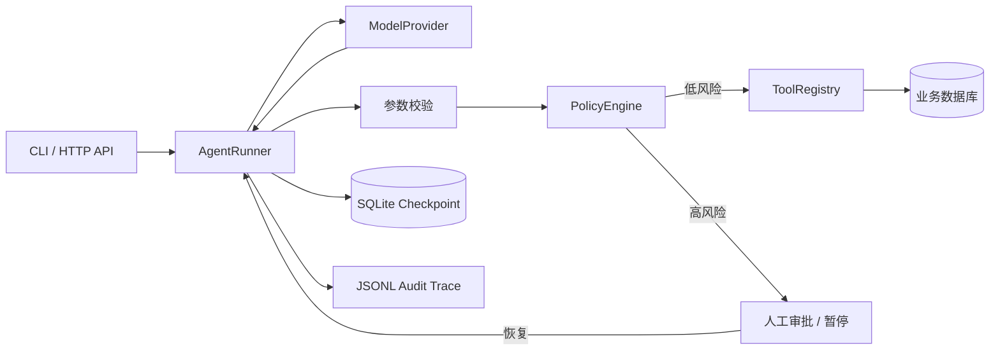

# Agent Harness：可运行的生产化 Agent 执行框架

这是一个为求职面试准备、但按真实业务约束设计的 Python Agent Harness。它不是“调用一次 LLM”的包装，而是负责控制整个 Agent 生命周期：模型决策、工具执行、参数校验、风险审批、失败重试、断点恢复、会话状态、审计追踪和离线评测。

项目只依赖 Python 标准库。没有 API Key 也能完整演示；配置 OpenAI-compatible endpoint 后可接入真实模型。

## 30 秒运行

要求 Python 3.11+。在项目根目录执行：

```bash
python -m agent_harness demo
```

## 可视化控制台

启动服务：

```bash
python -m agent_harness serve --port 8080
```

然后打开 `http://127.0.0.1:8080`。控制台支持：

- 在浏览器内切换离线 Demo 或 OpenAI-compatible 模型；
- 发起多轮 Agent 任务并查看实时状态；
- 可视化模型、策略、工具与审批事件时间线；
- 对高风险工具调用执行批准或拒绝；
- 查看 SQLite 中持久化的历史运行；
- API Key 只保存在服务进程内，配置查询不会回传密钥。

真实模型选择以你的服务商和账号实际可用模型为准。生产环境建议通过环境变量或 Secret Manager 注入 Key，不要让普通终端用户直接配置供应商密钥。

这会演示一笔真实的售后流程：读取订单 `ORD-1001` → 发现物流延误 → 申请退款 → 命中 200 元人工审核阈值 → 持久化并暂停 → 模拟审批 → 从检查点恢复 → 幂等退款 → 通知客户。

继续验证：

```bash
python -m unittest discover -s tests -v
python -m agent_harness eval
```

也可以安装成命令：

```bash
python -m pip install -e .
agent-harness demo
```

## 核心架构



一次运行的状态机是：

```text
RUNNING -> model -> tool call -> validate -> policy
    ├── execute -> observation -> model ... -> COMPLETED
    ├── approval required -> WAITING_APPROVAL -> resume -> RUNNING
    ├── model/tool failure -> retry or FAILED
    └── too many turns -> MAX_STEPS
```

最重要的边界是：**模型负责提出动作，Harness 负责决定动作是否能执行。** Prompt 不是权限系统，退款、发消息等副作用必须经过确定性的代码策略。

## 已实现能力

| 能力 | 实现方式 | 业务价值 |
|---|---|---|
| Agent loop | 模型 → 工具 → 观察结果 → 模型，带明确终止条件 | 避免无限循环和“假装执行” |
| Provider 抽象 | `ModelProvider` 协议；离线 Demo 与 OpenAI-compatible 实现 | 可测试、可换模型、避免供应商锁定 |
| 类型化工具 | `@tool` 从函数签名生成 JSON Schema | 降低参数幻觉和接入成本 |
| 工具错误回灌 | 未知工具、参数错误、执行失败都变成结构化 observation | 模型可以修正，而不是进程直接崩溃 |
| 确定性策略 | `PolicyEngine` 与可组合 rule | 权限不依赖 prompt |
| Human-in-the-loop | 高额退款暂停；批准/拒绝后恢复 | 支持资金、发布、删除等高风险动作 |
| Durable checkpoint | 每一步保存到 SQLite | 进程重启后审批任务仍可恢复 |
| 批量工具安全 | 暂停时保存同批次尚未执行的调用 | 不丢工具调用，也不会绕过审批 |
| 业务幂等 | `refunds.order_id` 唯一约束 | 重试和恢复不会重复退款 |
| 会话延续 | 相同 `session_id` 继承已完成历史 | 支持多轮业务对话 |
| 超时与重试 | 模型指数退避；工具按副作用与幂等性决定是否重试 | 控制瞬时故障，避免重复写 |
| 可观测性 | 脱敏 JSONL 事件、API 内存指标 | 可定位模型、策略、工具和耗时问题 |
| 评测 | 三个确定性安全/质量用例 | 变更可回归，不靠手工“聊几次” |
| 服务接口 | 健康检查、运行、查询、审批、Prometheus 文本指标 | 可以接前端、工作流或审批系统 |

## 目录导览

```text
agent_harness/
  runner.py       # 核心状态机、重试、暂停和恢复
  tools.py        # 工具注册、Schema 生成、校验、超时
  policy.py       # 业务策略和人工审批判定
  storage.py      # 运行检查点
  tracing.py      # 脱敏审计事件
  providers.py    # 离线模型与真实模型适配器
  application.py  # 电商售后业务、事务与幂等示例
  api.py          # 零依赖 HTTP API
  evals.py        # 离线回归评测
tests/             # 单元和端到端流程测试
docs/              # 面试讲解与生产演进方案
```

## 使用真实模型

框架实现的是 OpenAI-compatible Chat Completions 适配层，便于接入多种服务。先设置：

```bash
set HARNESS_PROVIDER=openai-compatible
set OPENAI_API_KEY=your-key
set OPENAI_MODEL=your-available-model
set OPENAI_BASE_URL=https://api.openai.com/v1
python -m agent_harness run "查询 ORD-1001，若确实延误则退款"
```

PowerShell 使用 `$env:变量名="值"`。不要把 `.env` 或 Key 提交到代码仓库。

为什么核心没有直接依赖某家 SDK？这是一个面试用 runtime：标准库实现让 Agent loop、消息协议和失败边界完全可见。生产项目若只使用 OpenAI，应新增 Responses API provider 或直接采用官方 Agents SDK，以获得官方托管工具、流式事件和 tracing 等能力，而不是长期维护所有协议细节。

## HTTP API

启动本地服务：

```bash
python -m agent_harness serve --port 8080
```

创建运行：

```bash
curl -X POST http://127.0.0.1:8080/v1/runs \
  -H "Content-Type: application/json" \
  -d '{"input":"订单 ORD-1001 延误，请退款","session_id":"customer-42"}'
```

如果返回 `waiting_approval`，提交审批：

```bash
curl -X POST http://127.0.0.1:8080/v1/runs/RUN_ID/approval \
  -H "Content-Type: application/json" \
  -d '{"approved":true,"approver":"risk-manager-7"}'
```

其他接口：

- `GET /health`
- `GET /metrics`
- `GET /v1/runs/{run_id}`

设置 `HARNESS_API_KEY` 后，请求必须携带 `X-API-Key`。服务默认只绑定 `127.0.0.1`；Docker 或生产部署前必须配置鉴权、TLS 和网络边界。

## 扩展一个工具

```python
from agent_harness import ToolContext, ToolRegistry, tool

@tool(
    description="取消尚未发货的订单。会修改订单状态。",
    side_effect="write",
    requires_approval=True,
    idempotent=True,
)
def cancel_order(order_id: str, reason: str, context: ToolContext) -> dict:
    return order_service.cancel(
        order_id=order_id,
        reason=reason,
        idempotency_key=context.run_id,
    )

registry = ToolRegistry()
registry.register(cancel_order)
```

描述中应该写清楚何时使用、输入含义、副作用、是否可重试和常见错误。真正的授权仍放在 `PolicyEngine`、业务服务和数据库约束中。

## 为什么这些设计适合真实业务

LLM 调用具有概率性，但支付、退款、工单、通知都是确定性副作用。生产系统最危险的问题不是“回答不够聪明”，而是重复执行、越权执行、部分成功和无法审计。本项目用三层约束处理：

1. Harness 层限制步数、参数类型、工具名单和审批规则。
2. 业务服务再次验证订单状态和金额，不信任模型参数。
3. 数据库唯一约束提供最终幂等保证，不信任网络重试。

这仍不是完整生产平台。上线前至少需要：

- SQLite 换成 PostgreSQL，并加入版本号、租约或队列，解决多实例并发恢复。
- 写操作采用 idempotency key + transactional outbox；“恰好一次”通常应转化为“至少一次投递 + 幂等消费”。
- 企业 SSO/RBAC、租户隔离、审批过期、双人复核与审计留存策略。
- OpenTelemetry trace、集中日志、模型/工具延迟与成本告警。
- 限流、熔断、带随机抖动的退避、供应商 fallback 和按业务价值分配 token budget。
- 上下文压缩、检索式记忆、数据保留期限和用户删除机制。
- 对 prompt injection、数据外传、恶意工具参数做 threat model；代码/浏览器工具必须放在隔离沙箱。
- 真实脱敏/分类系统替代示例正则；日志不记录完整模型原文和敏感工具结果。
- 基于真实流量构造 eval 集，发布前回归，并通过 canary/A-B 观察成功率、人工接管率、误执行率、P95 延迟和单任务成本。

详细的面试讲法见 [docs/interview-guide.md](docs/interview-guide.md)。

## 参考的开源设计

本项目没有复制这些框架，而是提炼了它们共同的 runtime 思想：

- [OpenAI Agents SDK：Agent loop 与 continuation](https://developers.openai.com/api/docs/guides/agents/running-agents)
- [OpenAI Agents SDK：Guardrails 与人工审批](https://developers.openai.com/api/docs/guides/agents/guardrails-approvals)
- [LangGraph：持久化 interrupt / human-in-the-loop](https://langchain-ai.github.io/langgraph/how-tos/human_in_the_loop/breakpoints/)
- [Pydantic AI：durable execution](https://github.com/pydantic/pydantic-ai/blob/main/docs/durable_execution/overview.md)
- [Microsoft AutoGen：有状态 Agent teams](https://microsoft.github.io/autogen/stable/user-guide/agentchat-user-guide/tutorial/teams.html)
- [Hugging Face smolagents：多步 Agent 与类型化工具](https://huggingface.co/docs/smolagents/reference/agents)

## License

MIT。面试时请用自己的语言讲清取舍，也建议替换示例业务和 README 作者信息，使项目与个人经历一致。
