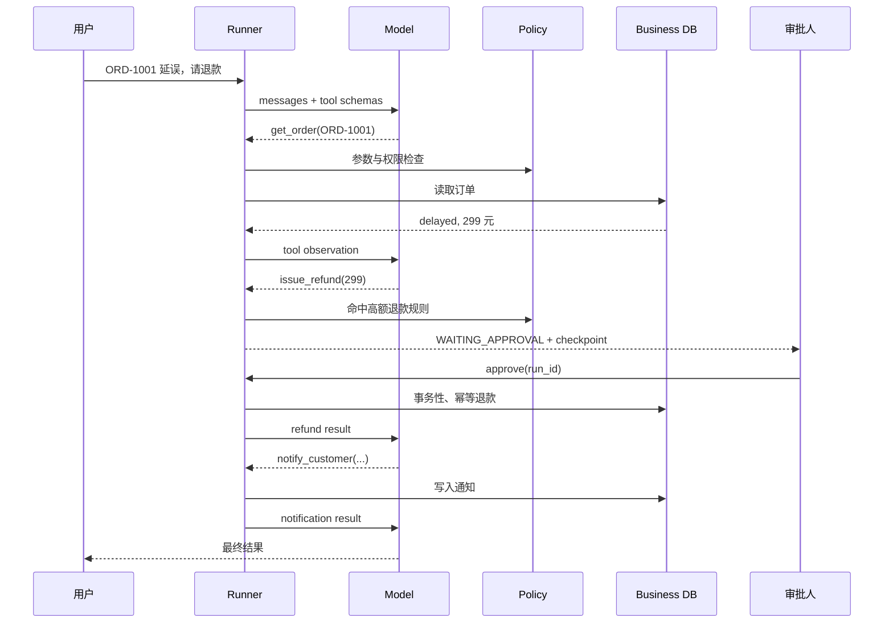

# Agent Harness 面试讲解手册

## 90 秒项目介绍

“这个项目解决的是 LLM 从聊天模型变成业务执行 Agent 后的可靠性问题。模型本身只负责决定下一步，Harness 控制工具调用、权限、审批、持久化、重试、审计和停止条件。我用电商售后做例子：Agent 先查订单，高额退款会进入人工审批并持久化；即使进程重启，也能从检查点继续。业务服务还会重新验证订单状态和金额，并用数据库唯一约束保证退款幂等。项目可以无 Key 演示，也提供真实模型适配、HTTP API、指标、测试和离线 eval。”

## 代码讲解顺序

建议面试时按一次请求的数据流讲，而不是逐个文件背代码：

1. `application.py` 把 Agent、工具、业务数据库和策略组装起来。
2. `runner.py` 调模型，收到结构化 tool call 后进入校验和策略判定。
3. `tools.py` 从类型注解生成 Schema，并控制工具超时和重试语义。
4. `policy.py` 对 200 元以上退款发出审批，而不是让模型自行判断权限。
5. `storage.py` 保存完整状态；`resume()` 在审批后继续同一个调用链。
6. `application.py` 的业务数据库再次校验金额，并用唯一键防重复退款。
7. `tracing.py` 记录脱敏事件；`evals.py` 验证关键安全行为。

## 完整请求时序



## 面试官常问的设计题

### 为什么不直接使用 LangGraph / Agents SDK？

面试项目的目标是展示对 runtime 的理解，所以核心用少量标准库实现，状态机、消息协议和副作用边界都能读到。实际业务会按团队情况选择：强依赖 OpenAI 能力时优先官方 Agents SDK；复杂图工作流与持久化编排可选 LangGraph；已有 Temporal/DBOS 基础设施时将每个副作用做成 durable activity。自研的前提是需求足够特殊且团队愿意长期维护协议兼容、可观测性和安全边界。

### Prompt 已经写“退款前审批”，为什么还要 PolicyEngine？

Prompt 是概率性行为约束，不是授权边界。模型可能被 prompt injection 影响、可能理解错误、模型升级后也可能漂移。审批规则必须是确定性的代码，并且业务服务仍需二次鉴权与校验。

### 为什么工具错误不直接抛出终止？

参数错误、临时查不到数据或工具不存在，有时模型可以根据结构化错误修正下一次调用。框架把错误封装成 observation，同时限制最大步数，既保留自我修复能力，又避免无限循环。鉴权失败、预算超限等不可恢复错误则应立即停止。

### 怎么避免重复退款？

三道防线：写工具默认不自动重试；恢复时使用稳定的业务幂等键；数据库对 `order_id` 建唯一约束。真正跨服务时，应由调用方发送 idempotency key，收款服务持久化去重结果。通知类动作则用 transactional outbox，避免数据库已提交但消息未发出的“双写”问题。

### 工具调用超时后线程可能还在运行，怎么办？

当前标准库实现只能让 Harness 不再等待，无法安全杀死 Python 线程，因此副作用工具仍必须幂等。这是示例的已知边界。生产中应把工具放在独立 worker/容器，通过任务队列、租约和执行超时控制；不可信代码必须用进程或沙箱隔离，不能在线程里执行。

### 多实例同时恢复同一个 run 怎么办？

当前 runner 只提供进程内按 `run_id` 加锁。生产数据库需要 `version` 字段做 compare-and-swap，或者 `SELECT ... FOR UPDATE SKIP LOCKED` / 分布式租约；审批事件也需要唯一事件 ID，确保重复 webhook 不会重复推进状态机。

### Memory 怎么设计？

本项目对相同 `session_id` 继承已完成历史，适合短会话。生产中把记忆拆成三类：当前工作状态放 checkpoint；短期对话做窗口裁剪/摘要；长期用户事实进入有来源、可删除的结构化存储或检索库。不要把全部聊天永久塞回 prompt，也不要把模型总结当成唯一事实源。

### 如何衡量 Agent 是否上线成功？

不能只看回答“像不像”。至少同时看：任务完成率、工具参数正确率、误执行率、人工审批/接管率、重试与失败原因、P50/P95 延迟、每个完成任务成本、客户复联率。安全指标需要单独设门槛，不能用平均质量抵消一次高风险误操作。

## 失败场景与处理

| 故障 | 当前处理 | 生产增强 |
|---|---|---|
| 模型 429/超时 | 有界指数退避 | jitter、熔断、fallback、队列 |
| 模型反复调用 | `max_steps` 停止 | loop detector、预算与重复调用指纹 |
| 参数类型错误 | 结构化错误回灌 | Structured Outputs、业务字段约束 |
| 高风险写操作 | 持久化后等待审批 | RBAC、审批过期、双人复核 |
| 写请求重复 | 业务唯一键幂等 | 全链路 idempotency key |
| 进程重启 | SQLite checkpoint 恢复 | PostgreSQL + worker lease |
| DB 成功、通知失败 | 可由 Agent 再次处理 | transactional outbox |
| 日志泄露 PII | 正则脱敏 | 数据分类、字段白名单、DLP |
| Prompt injection | 工具白名单与策略层 | 数据/指令分区、egress policy、红队 eval |

## 从 Demo 演进到生产的路线

第一阶段先做单 Agent、只读工具、离线 eval 和全量 tracing，确认业务价值。第二阶段才开放少量幂等写工具并加审批。第三阶段引入 durable worker、PostgreSQL、队列、租户权限和 outbox。最后再考虑多 Agent；只有当角色之间确实存在不同权限、上下文或模型经济性时才拆分，不能把多 Agent 当作默认答案。

## 可现场演示的命令

```bash
# 完整批准路径
python -m agent_harness demo

# 拒绝路径
python -m agent_harness demo --deny

# 安全/质量回归
python -m agent_harness eval

# 查看某个持久化 run 的完整状态
python -m agent_harness show RUN_ID

# 启动 API
python -m agent_harness serve
```

演示时重点打开 `runtime/traces.jsonl`，让面试官看到模型、策略、审批和工具事件是分开的；这通常比只展示最终聊天页面更能体现工程能力。
